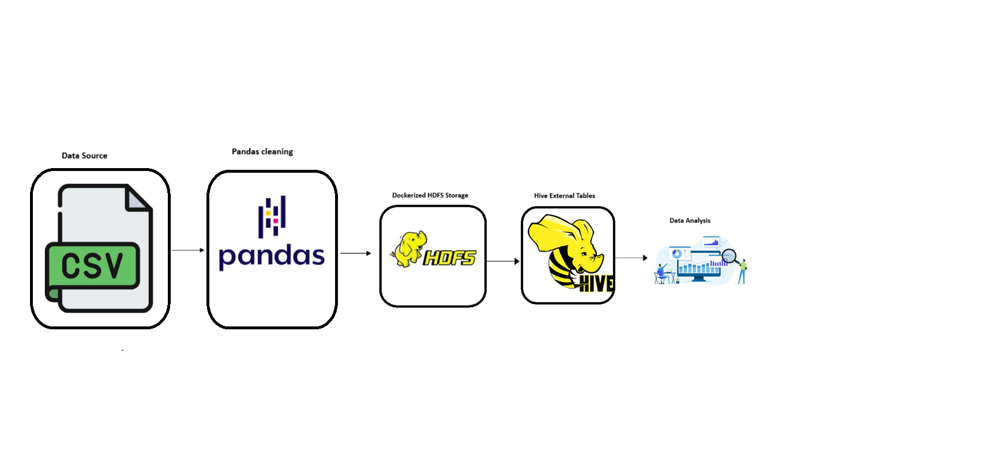

# Healthcare-Data-Analytics-Pipeline
## Purpose
This project implements a data pipeline to process healthcare data stored in CSV format. The pipeline involves data cleaning using Pandas, conversion to Parquet format, storage in a containerized HDFS environment, and analysis using Apache Hive.

## Objectives
 - Extract raw healthcare data from CSV files.
  
 - Clean and preprocess data using Pandas.
  
 - Convert cleaned data to Parquet format for efficient storage.
  
 - Store Parquet files in HDFS within a Docker container.
  
 - Create Hive external tables for SQL-based analysi


## Pipeline Overview
1. **Data Cleaning (Pandas)**  
   - Load raw CSV files using Pandas.
   - Clean and preprocess the data (handle nulls, format timestamps, etc.).

2. **Parquet Conversion**  
   - Convert cleaned DataFrames to `.parquet` format using PyArrow or Pandas.

3. **Namenode Container Storage**  
   - Copy the Parquet files into the HDFS Namenode container.

4. **HDFS Storage**  
   - Use `hdfs dfs -put` to upload the Parquet files into HDFS under `/user/hadoop/mimic`.

5. **Hive Analysis**  
   - Create Hive external tables on the Parquet files.
   - Run SQL queries for analytics (e.g., ICU readmission distribution).


## Full ETL Flow (in terms of files)
  1. Extract & Transform – scripts/data_cleaning.py
  
    Reads raw .csv files from data/raw/
    
    Cleans the data (null handling, type casting, formatting)
    
    Outputs cleaned DataFrame
  
  2. Load - Part 1 – scripts/convert_to_parquet.py
  
    Takes the cleaned DataFrame
    
    Converts it to .parquet files
    
    Stores in data/processed/
  
  3. Load - Part 2 – scripts/upload_to_hdfs.sh
  
    Copies Parquet files to HDFS directory (/user/hadoop/mimic/)
    
    Uses hdfs dfs -put or hdfs dfs -copyFromLocal
    
    Hive Table Creation – hive/create_tables.hql
  
  4. Creates external tables pointing to HDFS Parquet files
  
    . Connects to Hive and runs SQL queries for insights

## 📌 Data Pipeline Architecture

<p align="center">
  
</p>


## Technologies Used
- Python (Pandas, PyArrow)
- Hadoop (HDFS)
- Apache Hive
- Docker

## Documentation
For detailed setup and execution instructions, see the [User Manual](Docs/USER_MANUAL.md).

## Project Structure
<pre> ```healthcare-data-pipeline/
├── data/
│   └── raw/
│       ├── ADMISSIONS.csv
│       └── ...
├── notebooks/
│   └── data_cleaning.ipynb
├── scripts/
│   └── convert_to_parquet.py
├── docker/
│   ├── docker-compose.yml
│   └── hive/
│       └── hive-site.xml
├── hdfs/
│   └── mimic/
│       ├── ADMISSIONS.parquet
│       └── ...
├── hive/
│   ├── create_tables.hql
│   └── queries/
│       ├── icu_readmissions.sql
│       ├── top_diagnoses.sql
│       └── length_of_stay.sql
├── assets/
│   └── pipeline_architecture.png
|── Docs/User_Manual.md  # User Manual for the  project Here you will find any information you need.
└── README.md ``` <pre>


